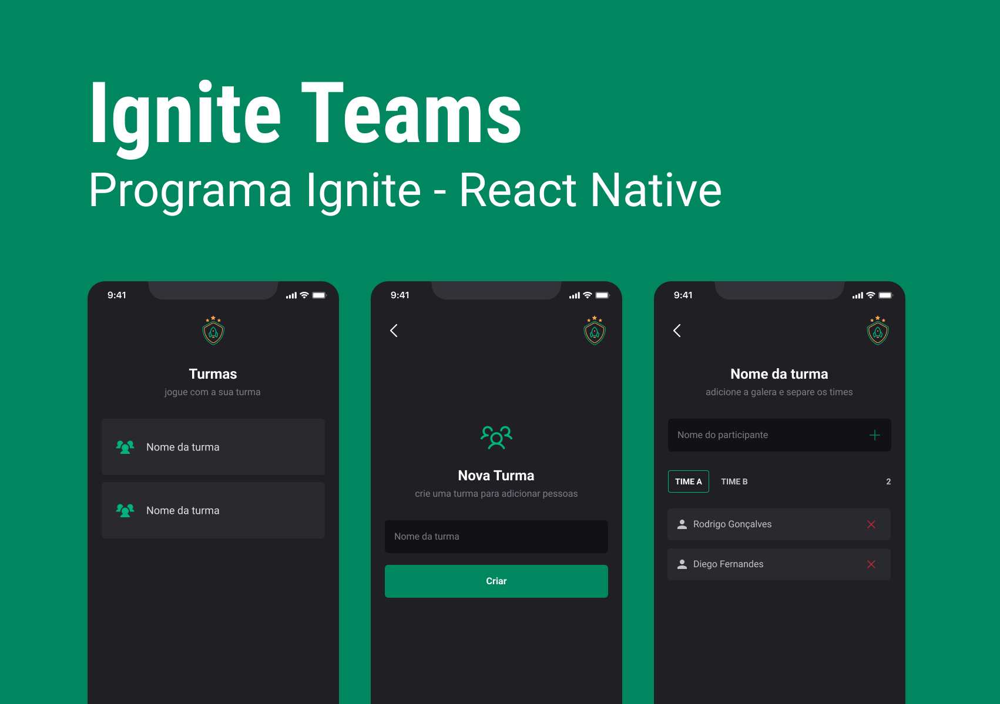
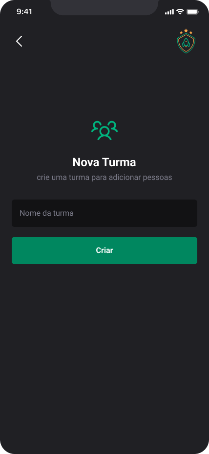
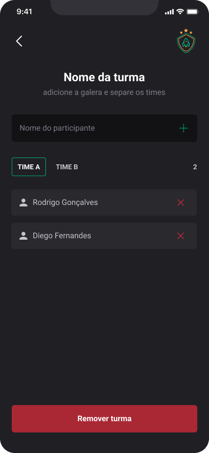
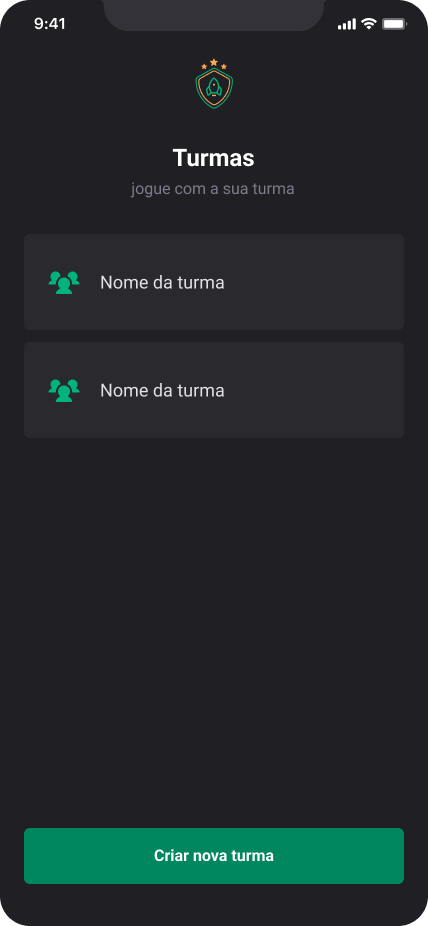

<h1>
  
</h1>

## 💻 Projeto

<h3>
  Projeto criado dentro da trilha de React Native 2022, feito por Rocketseat, para introdução sobre conceitos de Async Storage, uso de CSS-in-JS (styled-components) e muito mais...
</h3>

----

## ✨ Tecnologia

- **[TypeScript](https://www.typescriptlang.org/)**
- **[React Native](https://reactnative.dev/)**
- **[Expo](https://expo.dev/)**
- **[Styled-Components](https://styled-components.com/)**
- **[React Native - Async Storage](https://reactnative.dev/docs/asyncstorage)**
- **[React Navigation](https://reactnavigation.org/)**

---

## 🎨 Layout

O layout da aplicação está disponível no Figma:

    

  

  

---

## 🚀 Como executar o projeto

**Para que esse projeto funcione corretamente, é preciso estar com o servidor rodando.**

- Instale as dependências com `npm install`.
- Execute `npx expo start` para iniciar o servidor do Expo.

---

## ⚙️ Funcionalidades

- [x] Deve ser possível criar uma turma ou grupo
- [x] Adicionar participantes, separando por times A e B.
- [x] Remover participantes individualmente
- [x] Remover turma/grupo por inteiro
- [x] Listar grupos criados

